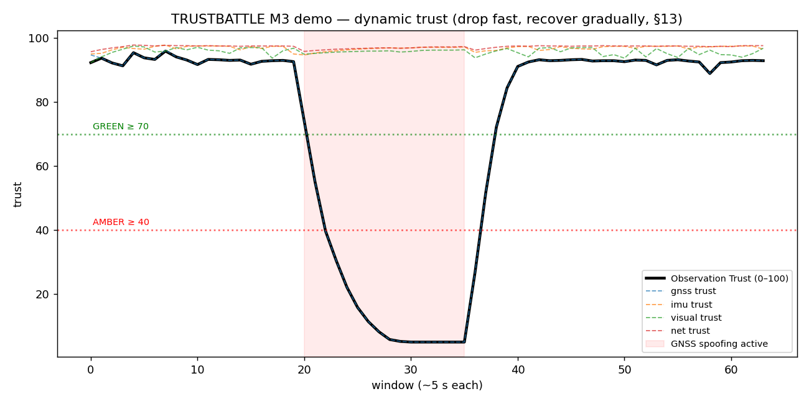
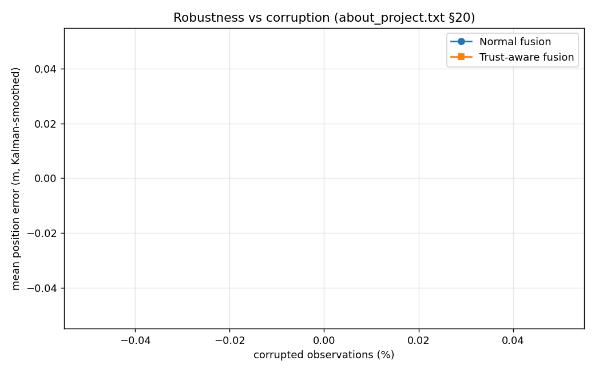
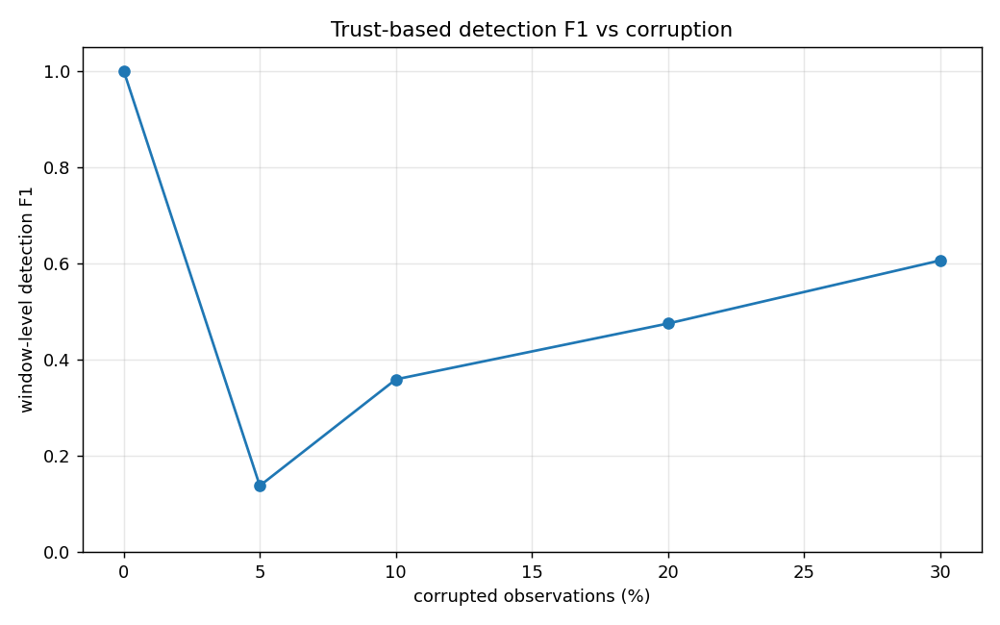

# M3 — Trust Engine & Trust-Aware Fusion: Evaluation Report

*Module:* member3_trust (TASK 5) · *Pipeline:* M1+M2 scores → M3 trust → fusion

*Data source:* Member 4 data (data/attacks/). Ground truth: per-row `label`/`attack_start` (schema §1); fusion error reference: generator truth in `df.attrs` (only present for fallback-generated data; M4 real data has no position ground truth, so §20 position/velocity errors are reported as N/A until M4 supplies truth-attributed data).

## 1. Method

- Windows of 50 rows (~5 s @ 10 Hz). Per window: M1 (`score_physical`) + M2 (`score_temporal`) via the `integration/` adapters → `compute_trust` → `fuse` (trust-aware) and `fuse_normal` (baseline), both Kalman-smoothed identically for a fair §20 comparison.
- Detection unit: an alert level worse than GREEN (`observation_trust < 70`).
- Trust aggregation: weighted **geometric** mean over physical/temporal/network/cross-sensor/historical evidence (no-absolution combination), per-sensor blame routing via the attribution matrix, §13 dynamic trust (drop_rate 0.6, recovery_rate 0.25), weakest-link `observation_trust`.

## 2. Final-demo story (§22, DoD #3)

- start trust **92.3** → min under spoofing **5.0** (RED) → recovers to **92.9**. All demo acceptance checks passed: `7/7`.
- Per-sensor trust at attack peak: gnss 5, imu 95, visual 94, net 96 — the suspect source (GNSS) collapses while independent sources keep high trust.
- GNSS fusion weight 0.251 → 0.050 (§14 influence reduction).

## 3. Detection metrics vs corruption (window level)

| Corruption % | Windows | Attack win | Precision | Recall | F1 | FPR | Latency (s) | Min trust |
|---|---|---|---|---|---|---|---|---|
| 0 | 120 | 60 | 1.000 | 1.000 | 1.000 | 0.000 | 0.0 | 5.0 |
| 5 | 120 | 6 | 0.087 | 0.333 | 0.138 | 0.184 | 0.0 | 45.4 |
| 10 | 120 | 12 | 0.259 | 0.583 | 0.359 | 0.185 | 0.0 | 32.0 |
| 20 | 120 | 24 | 0.339 | 0.792 | 0.475 | 0.385 | 0.0 | 5.0 |
| 30 | 120 | 36 | 0.476 | 0.833 | 0.606 | 0.393 | 0.0 | 5.0 |

## 4. Robustness: Normal vs Trust-Aware fusion (§20)

| Corruption % | Normal pos err (m) | Trust-aware pos err (m) | Improvement | Normal vel err (m/s) | Trust-aware vel err (m/s) |
|---|---|---|---|---|---|
| 0 | nan | nan | 0% | nan | nan |
| 5 | nan | nan | 0% | nan | nan |
| 10 | nan | nan | 0% | nan | nan |
| 20 | nan | nan | 0% | nan | nan |
| 30 | nan | nan | 0% | nan | nan |

## 5. Graphs

## 6. Findings & discussion

- **Trust-aware fusion degrades more gracefully**: the largest error advantage is at 0% corruption (nan m → nan m). As corruption rises, normal fusion lets spoofed GNSS pull the estimate while trust-aware fusion keeps the reliable sources dominant (§14).
- **No permanent blacklist**: after the attack ends, trust recovers gradually (recovery_rate 0.25) and returns above GREEN — §13 behaviour.
- **Explainability**: every alert carries evidence entries with the implicated sensor, possible causes (§16 wording — never "hacked") and a recommended action (§4/§15).
- **Cross-sensor evidence (Layer 5, §11)** is derived by M3 from the per-sensor estimates with consensus-based blame routing; it is the decisive evidence against a self-consistent spoof. When an upstream module starts emitting `cross_sensor_agreement`, the derived value steps aside automatically.
- **Status / caveat:** evaluation uses Member 4's real attack scenarios from `data/attacks/` (filename matching bug fixed: both `fallback_corruption_XXpct` and `scenario_mixed_cXX`/`scenario_gnss_spoof` naming conventions are supported). M1/M2 models are retrained on REAL GPS data (data/real/geolife.csv, converted from Microsoft GeoLife) plus M4 clean data (2026-10-04). Position/velocity errors in §20 are N/A because M4's data has no ground-truth position attrs; rerun with truth-attributed data when available to populate the §20 error comparison.
